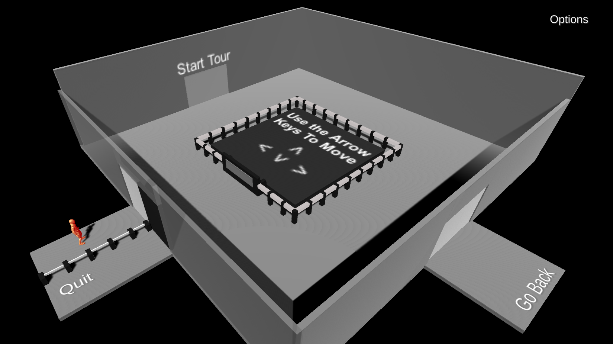
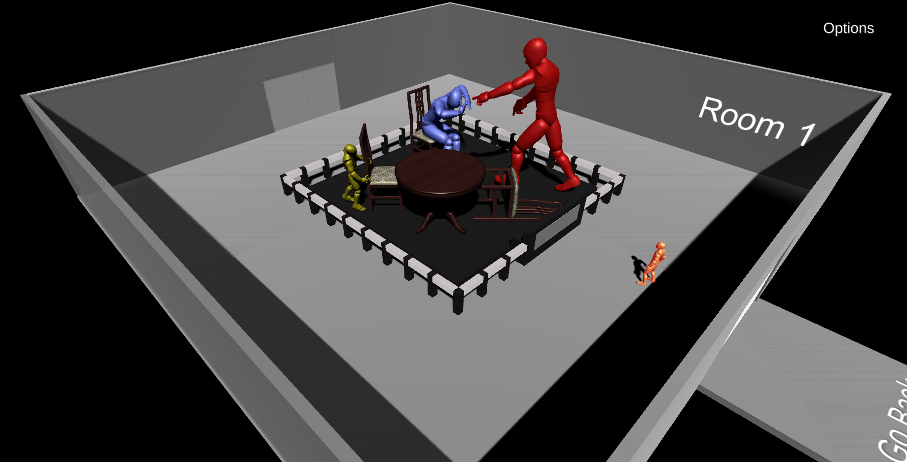
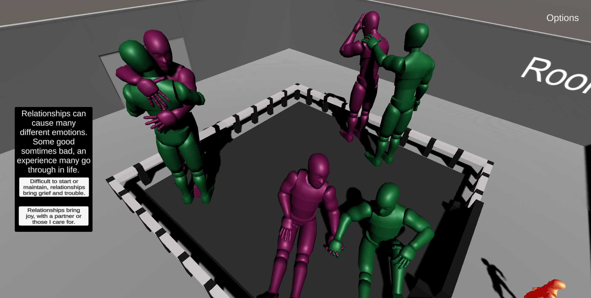
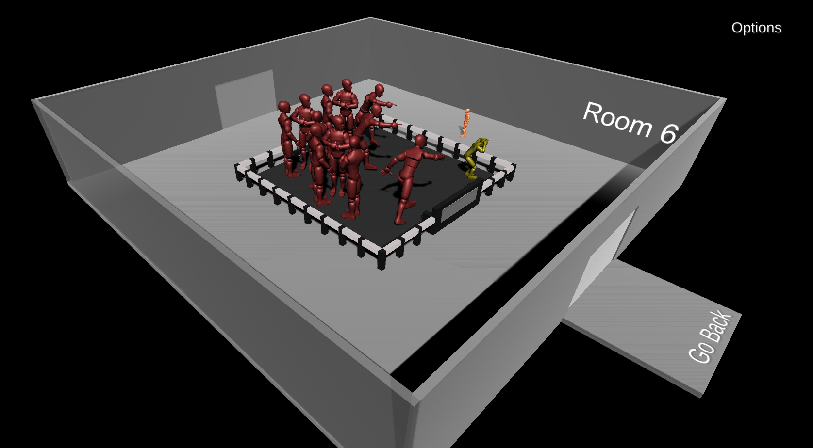
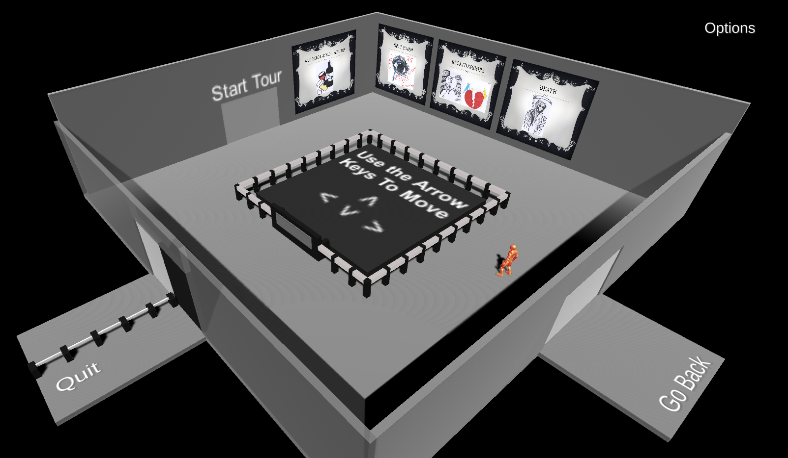
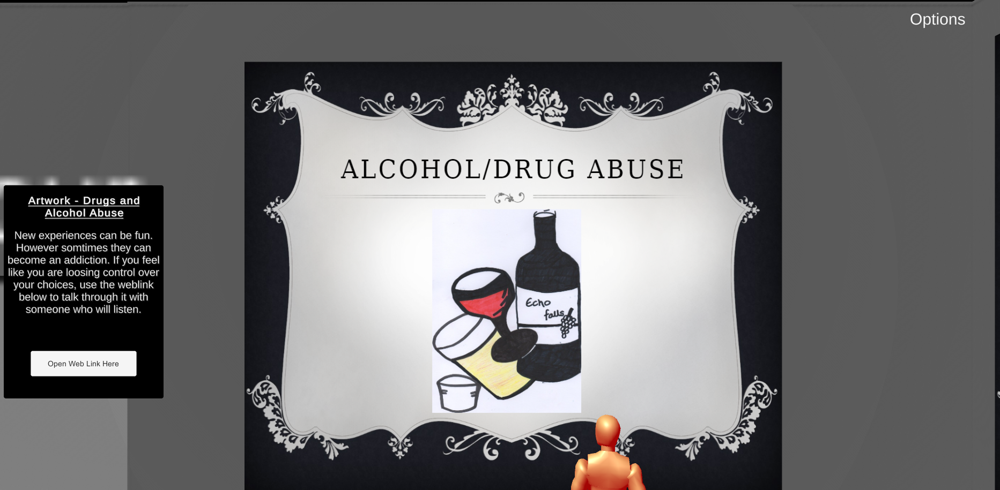

## Cards Of Life

**Project description:** The project was based off a CodeRED scenario presented as a method to reduce early school leaving. Done via the use of game-based learning through creation of a serious game which can present the users with information required on different topics. The project was also documented including design matrix, storyboard, detail of game design. (To view this documentation please ask)

### 1. Game Overview
The game was developed in Unity using C#. Models were created low-poly in blender. Animations for the player model were created in blender. Animations in the environment are created inside Unity.

The gameplay is designed to present topics which may be unconfortable to talk about, ask the user if they are having problems relating to this topic and then present them with information which could help. The game acheives this by presenting a journey or "tour" through an art gallery, where the exhibits in each room represent a topic. Users interact with the exhibit sign to get a close up view and be asked a statement question. The users answer will change what artwork is presented when finishing the tour.

### 2. Gameplay examples









### 3. Code Snippets

Audio Control
```C#
public class BackgroundAudio : MonoBehaviour
{
    private BackgroundAudio instance = null;

    private BackgroundAudio Instance
    {
        get { return instance; }
    }

    private void Awake()
    {
        if(instance != null && instance != this)
        {
            Destroy(this.gameObject);
            return;
        }
        else
        {
            instance = this;
        }
        //Use for music on different scenes.
        //DontDestroyOnLoad(this.gameObject);
    }
}
```

Options Menu Implementation
```C#
public class OptionsMenuButton : MonoBehaviour
{
    public GameObject VolumeControl;
    public GameObject ResolutionControl;
    public GameObject QualityControl;
    public GameObject FullScreenControl;

    public bool visible;

    public void TurnOnOrOffOptions()
    {
        if(visible == true)
        {
            visible = false;

            VolumeControl.SetActive(false);
            ResolutionControl.SetActive(false);
            QualityControl.SetActive(false);
            FullScreenControl.SetActive(false);
        }


        else if (visible == false)
        {
            visible = true;

            VolumeControl.SetActive(true);
            ResolutionControl.SetActive(true);
            QualityControl.SetActive(true);
            FullScreenControl.SetActive(true);
        }
    }
}
```

Player Movement
```C#
public class ThirdPersonMovement : MonoBehaviour
{

    public CharacterController controller;
    Animator anim;

    public float speed = 6f;

    public float turnSmoothTime = 0.1f;
    float turnSmootherVelocity;


    // Update is called once per frame
    void Update()
    {
        float horizontal = Input.GetAxisRaw("Horizontal");

        float vertical = Input.GetAxisRaw("Vertical");

        Vector3 direction = new Vector3(horizontal, 0f, vertical).normalized;

        if(direction.magnitude >= 0.1f)
        {
            float targetAngle = Mathf.Atan2(direction.x, direction.z) * Mathf.Rad2Deg;
            //Atan2 is a math function, which returns the angle between the x and y axis 

            float angle = Mathf.SmoothDampAngle(transform.eulerAngles.y, targetAngle, ref turnSmootherVelocity, turnSmoothTime);

            transform.rotation = Quaternion.Euler(0f, angle, 0f);

            controller.Move(direction * speed * Time.deltaTime);
        }
    }
}
```
