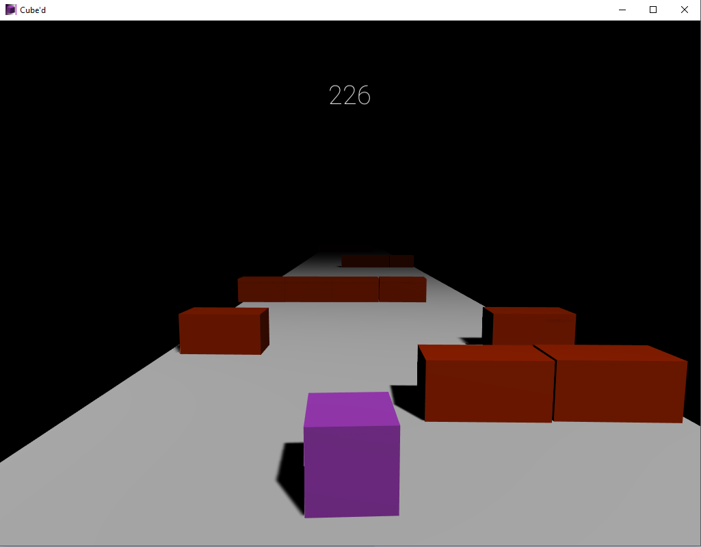
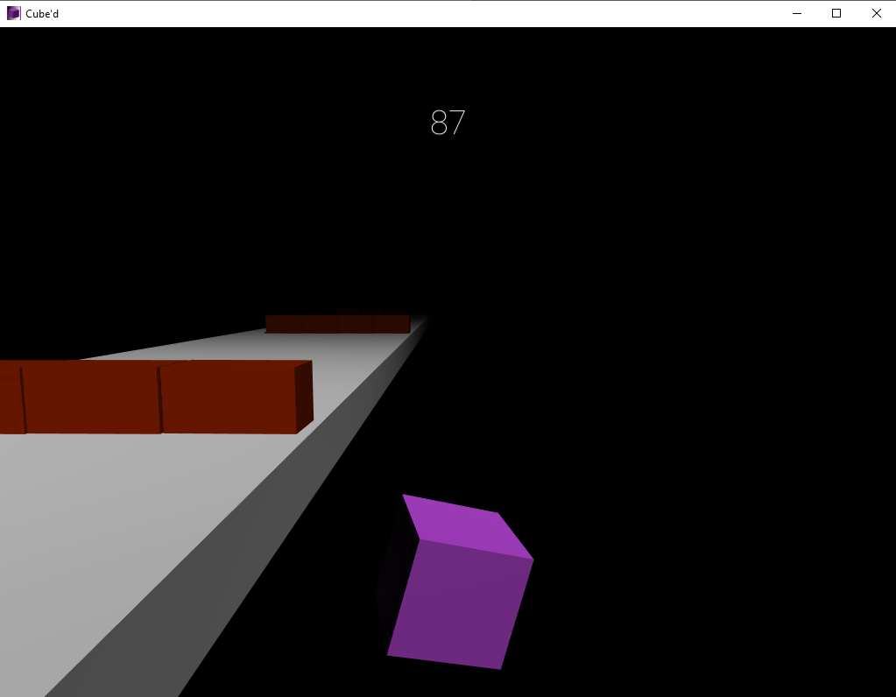

## Cube'd

**Project description:** Cube'd is a simple 3D "runnner" style game. Where the objective is to avoid the obstacles and progress through the levels.

### 1. Overview
The application is built in Unity using C++. The game consists of three levels which progressivly get harder. The core game features are the levels and the score based system. Falling off the map or colliding with an object will cause the player to lose, restarting the game automatically. 

### 2. Gameplay Examples






### 3. Code Examples

Score
```C++
public class Score : MonoBehaviour
{
    public Transform player;
    public Text scoreText;
    
    void Update()
    {
        scoreText.text = player.position.z.ToString("0");
    }
}
```

Collision
```C+
public class PlayerCollision : MonoBehaviour
{
    public PlayerMovement movement;
    
    void OnCollisionEnter (Collision collisionInfo)
    {
        if (collisionInfo.collider.tag == "Obstacle")
        {
            movement.enabled = false;
            FindObjectOfType<GameManager>().EndGame();
        }
    }
}
```

Movement
```C+
public class PlayerMovement : MonoBehaviour
{
    public Rigidbody rb;
    
    public float forwardForce = 2000f;
    public float sidewaysForce = 500f;

   void FixedUpdate()
   {
        //add forward force
        rb.AddForce(0, 0, forwardForce * Time.deltaTime); 

        if ( Input.GetKey("d") )
        {
            rb.AddForce(sidewaysForce * Time.deltaTime, 0, 0, ForceMode.VelocityChange);
        }

        if (Input.GetKey("a"))
        {
            rb.AddForce(-sidewaysForce * Time.deltaTime, 0, 0, ForceMode.VelocityChange);
        }

        if (rb.position.y < -1.5f)
        {
            FindObjectOfType<GameManager>().EndGame();
        }
   }
}
```
