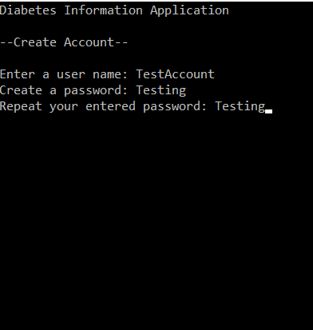
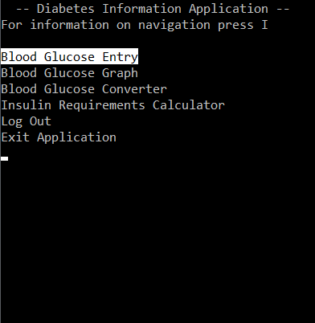
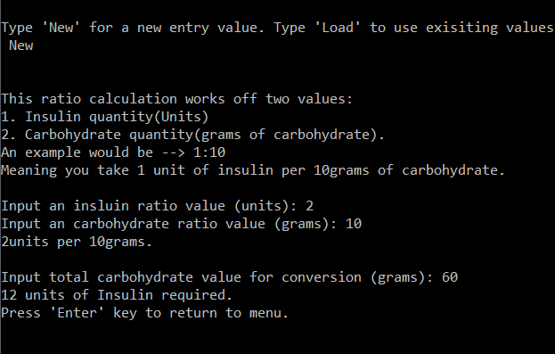
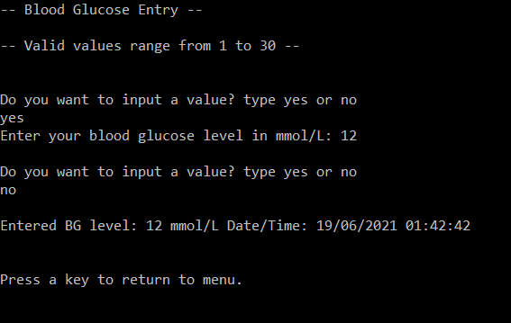

## Type 1 Diabetes Management application

**Project description:** This project is a console application demonstrating functions and requirements that would be implemented into a fully developed application relating to management of Type 1 Diabetes for a better quality of life when living with the condition.

### 1. Overview

This is a .NET application purely using C# within Visual Studio 2017. The applications primary functions are: Conversion of units, addition and storage of blood glucose levels, account creation, login and insulin requirements calculator.

### 2. Code Repository Link
https://github.com/PeckW/DiabetesManagementConsoleApplication

### 3. Application examples

