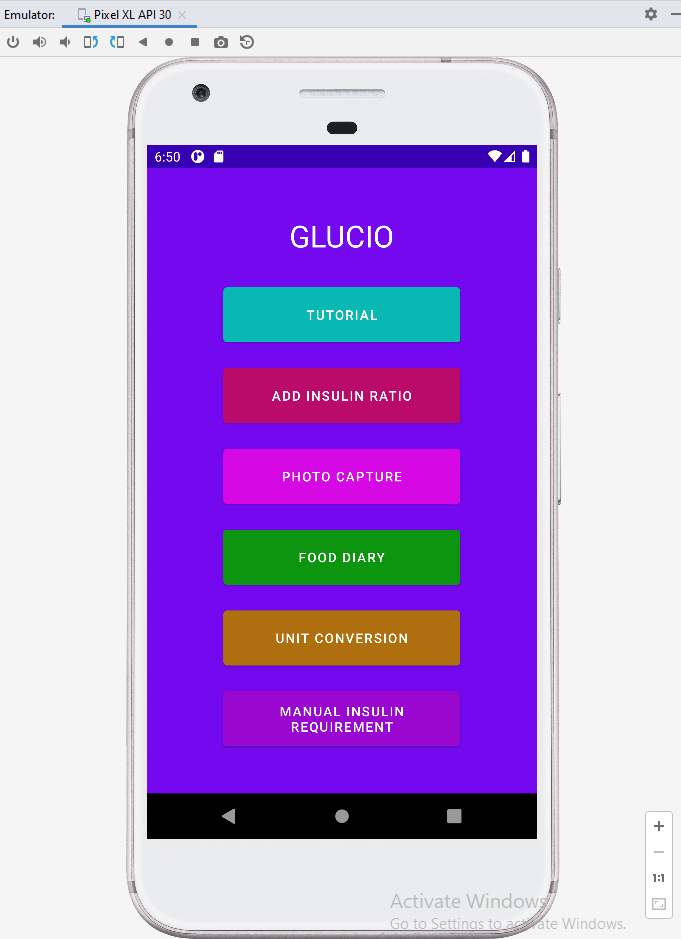
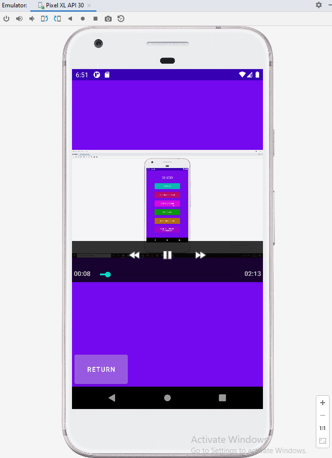
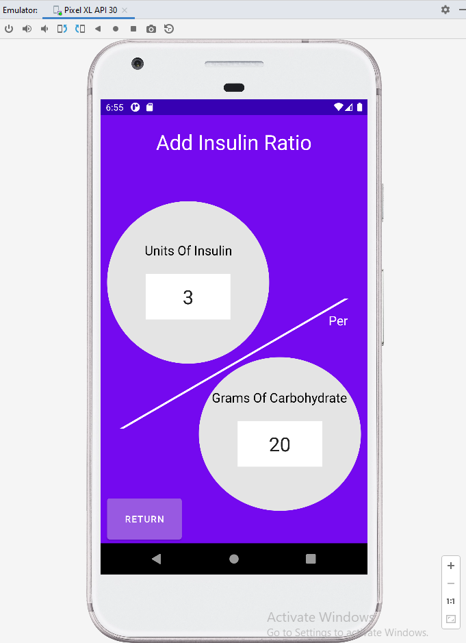
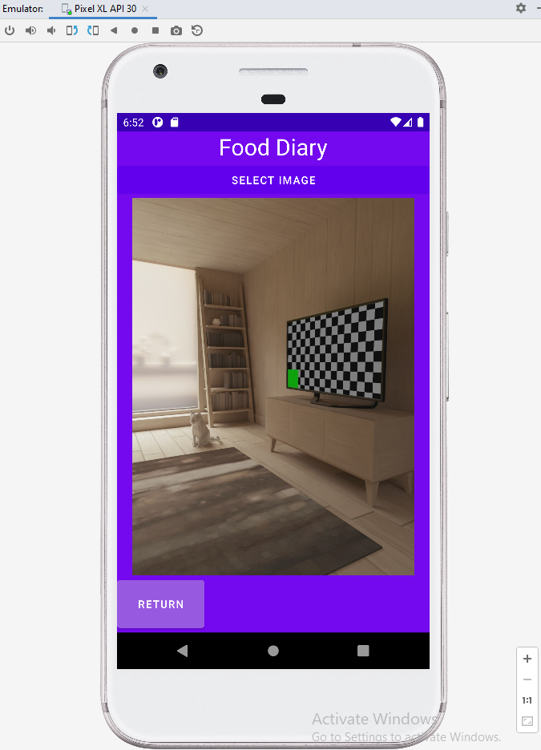

## Glucio
**Project description:** This projected aimed to create a Type 1 Diabetes Management application for mobile use. 

### 1. Overview
The project was created using Andriod Studio with JavaScript alongside a realtime database (Google Firebase) for data management. The core functions of the application are: video tutorial of application usage, Storage of insulin ratios, automatic calculation of insulin requirement, take photos of food / drinks, view photos taken within the application and manual calculation of insulin requirement. Application was tested and run using an emulator through the IDE.

### 2. Application Examples









### 3. Code Examples
Menu
```Javascript
public class mainMenuPage extends AppCompatActivity {

    private Button TutorialButton;
    private Button AddInsulinRatioButton;
    private Button ManualConversionButton;
    private Button ManualInsulinRequirementButton;
    private Button FoodDiaryButton;
    private Button ML_DetectionButton;

    @Override
    protected void onCreate(Bundle savedInstanceState) {
        super.onCreate(savedInstanceState);
        setContentView(R.layout.activity_main_menu_page);

        TutorialButton = (Button) findViewById(R.id.Tutorial);
        TutorialButton.setOnClickListener(new View.OnClickListener() {
            @Override
            public void onClick(View v) { openTutorialPage();}
        });

        AddInsulinRatioButton = (Button) findViewById(R.id.AddInsulinRatio);
        AddInsulinRatioButton.setOnClickListener(new View.OnClickListener() {
            @Override
            public void onClick(View v) { openAddInsulinRatio();}
        });

        ManualConversionButton = (Button) findViewById(R.id.ManualConversion);
        ManualConversionButton.setOnClickListener((new View.OnClickListener() {
            @Override
            public void onClick(View v) {openManualConversion();}
        }));

        ManualInsulinRequirementButton = (Button) findViewById(R.id.ManualInsulinRequirement);
        ManualInsulinRequirementButton.setOnClickListener(new View.OnClickListener() {
            @Override
            public void onClick(View v) {openManualInsulinRequirement();}
        });

        FoodDiaryButton = (Button) findViewById(R.id.FoodDiary);
        FoodDiaryButton.setOnClickListener(new View.OnClickListener() {
            @Override
            public void onClick(View v) {openFoodDiary();}
        });

        ML_DetectionButton = (Button) findViewById(R.id.Machine_Learning_Menu_Button);
        ML_DetectionButton.setOnClickListener(new View.OnClickListener() {
            @Override
            public void onClick(View v) {openML_Detection();}
        });

    }

    public void openTutorialPage()
    {
        Intent intent = new Intent(this, TutorialPage.class);
        startActivity(intent);
    }

    public void openAddInsulinRatio(){
        Intent intent = new Intent(this,AddInsulinRatioPage.class);
        startActivity(intent);
    }

    public void openManualConversion(){
        Intent intent = new Intent(this, InsulinUnitConversionPage.class);
        startActivity(intent);
    }

    public void openManualInsulinRequirement(){

        FirebaseDatabase database = FirebaseDatabase.getInstance();

        DatabaseReference insulinValueRef = database.getReference("InsulinRatio");
        insulinValueRef.addValueEventListener(new ValueEventListener() {
            @Override
            public void onDataChange(@NonNull DataSnapshot snapshot) {

                String InsulinRatioValues = snapshot.getValue(String.class);
                Log.d("TAG", "Ratio is: " + InsulinRatioValues);
            }

            @Override
            public void onCancelled(@NonNull DatabaseError error) {

                Log.w("TAG", "Failed to read value.", error.toException());
            }
        });

        DatabaseReference carbValueRef = database.getReference("CarbohydrateRatio");
        carbValueRef.addValueEventListener(new ValueEventListener() {
            @Override
            public void onDataChange(@NonNull DataSnapshot snapshot) {

                String CarbRatioValues = snapshot.getValue(String.class);
                Log.d("TAG", "Ratio is: " + CarbRatioValues);
            }

            @Override
            public void onCancelled(@NonNull DatabaseError error) {

                Log.w("TAG", "Failed to read value.", error.toException());
            }
        });

        Intent intent = new Intent(this,ManualInsulinRequirement.class);
        startActivity(intent);
    }

    public void openFoodDiary(){
        Intent intent = new Intent(this,FoodDiaryPage.class);
        startActivity(intent);
    }

    public void openML_Detection(){
        Intent intent = new Intent (this, MlDetection.class);
        startActivity(intent);
    }
}
```

Video Tutorial
```JavaScript
public class TutorialPage extends AppCompatActivity
{
    @Override
    protected void onCreate(Bundle savedInstanceState)
    {
        super.onCreate(savedInstanceState);
        setContentView(R.layout.activity_tutorial_page);

        Button returnButton = (Button) findViewById(R.id.return_Button);
        returnButton.setOnClickListener(new View.OnClickListener()
        {
            @Override
            public void onClick(View v)
            {
                CloseInsulinRequirementDetection();
            }
        });

        VideoView videoView = findViewById(R.id.Video_viewer);

        String videoPath = "android.resource://" + getPackageName() + "/" + R.raw.tutorial;
        Uri uri = Uri.parse(videoPath);

        videoView.setVideoURI(uri);

        MediaController mediaController = new MediaController(this);
        videoView.setMediaController(mediaController);

        mediaController.setAnchorView(videoView);
    }

    public void CloseInsulinRequirementDetection(){finish();}
}
```
Food Diary (Photo Viewer)
```JavaScript
public class FoodDiaryPage extends AppCompatActivity {

    private final int REQUEST_CODE_STORAGE_PERMISSION = 1;
    private final int REQUEST_CODE_SELECT_IMAGE = 2;
    Uri uri;
    Date date;

    private ImageView imageSelected;

    @Override
    protected void onCreate(Bundle savedInstanceState) {
        super.onCreate(savedInstanceState);
        setContentView(R.layout.activity_food_diary_page);

        imageSelected = findViewById(R.id.selectedImage);

        Button returnButton = (Button) findViewById(R.id.return_Button);
        returnButton.setOnClickListener(new View.OnClickListener()
        {
            @Override
            public void onClick(View v)
            {
                CloseFoodDiary();
            }
        });

        findViewById(R.id.buttonSelectImage).setOnClickListener(new View.OnClickListener() {
            @Override
            public void onClick(View v) {

                if(ContextCompat.checkSelfPermission(
                        getApplicationContext(), Manifest.permission.READ_EXTERNAL_STORAGE)
                        != PackageManager.PERMISSION_GRANTED){
                    ActivityCompat.requestPermissions(FoodDiaryPage.this, new String[]{Manifest.permission.READ_EXTERNAL_STORAGE}, REQUEST_CODE_STORAGE_PERMISSION);
                }
                else{
                    selectImage();
                }
            }
        });
    }

    private void selectImage(){

        Intent intent = new Intent(Intent.ACTION_GET_CONTENT, Uri.parse(InternalStoragePath()));
        intent.setDataAndType(uri, "image/*");
        //Log.d("TAG - image intent", String.valueOf(intent));

        try{
            startActivityForResult(intent, REQUEST_CODE_SELECT_IMAGE);
        }
        catch (Exception exception){
            Toast.makeText(this, "Error: " + exception, Toast.LENGTH_SHORT).show();
        }
    }

    @Override
    public void onRequestPermissionsResult(int requestCode, @NonNull String[] permissions, @NonNull int[] grantResults){
        super.onRequestPermissionsResult(requestCode, permissions, grantResults);

        if(requestCode == REQUEST_CODE_STORAGE_PERMISSION && grantResults.length > 0){
            if(grantResults[0] == PackageManager.PERMISSION_GRANTED){
                selectImage();
            }
            else{
                Toast.makeText(this, "Permission denied", Toast.LENGTH_SHORT).show();
            }
        }
    }

    @Override
    protected void onActivityResult(int requestCode, int resultCode, @Nullable Intent data) {
        super.onActivityResult(requestCode, resultCode, data);
        if(requestCode == REQUEST_CODE_SELECT_IMAGE && resultCode == RESULT_OK){
            if(data != null){
                Uri selectedImageUri = data.getData();
                if(selectedImageUri != null){
                    try{

                        InputStream inputStream = getContentResolver().openInputStream(selectedImageUri);
                        Bitmap bitmap = BitmapFactory.decodeStream(inputStream);
                        imageSelected.setImageBitmap(bitmap);


                    }catch (Exception exception){
                        Toast.makeText(this, exception.getMessage(), Toast.LENGTH_SHORT).show();
                    }
                }
            }
        }
    }

    private void CloseFoodDiary(){finish();}

    public String InternalStoragePath(){
        String photo_folder_path="";
        photo_folder_path = getExternalFilesDir(Environment.DIRECTORY_PICTURES).toString();
        Log.d("TAG - path", photo_folder_path.toString());

        File dir = new File(photo_folder_path);
        Environment.getExternalStorageState(dir);

        return photo_folder_path;
    }

    public File StoragePath(){

        File testFolder = new File(getExternalFilesDir(null).getAbsolutePath() + "/test");

        testFolder.mkdirs();

        if(!testFolder.exists()){
            testFolder.mkdirs();
        }

        Log.d("TAG - Photo Read", testFolder.toString());
        return testFolder;
    }
}
```
