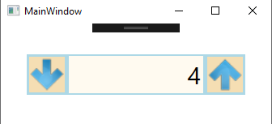
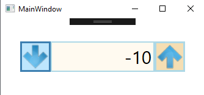
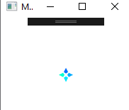

## Presented here are various small projects

**Project description:** Lorem ipsum dolor sit amet, consectetur adipiscing elit, sed do eiusmod tempor incididunt ut labore et dolore magna aliqua. Ut enim ad minim veniam, quis nostrud exercitation ullamco laboris nisi ut aliquip ex ea commodo consequat. Duis aute irure dolor in reprehenderit in voluptate velit esse cillum dolore eu fugiat nulla pariatur. Excepteur sint occaecat cupidatat non proident, sunt in culpa qui officia deserunt mollit anim id est laborum.

### 1. Numerical Spinner
Developed in C# + Xamarin. A simple numerical spinner for number selection.




```C#
namespace Spinner_1
{
    /// <summary>
    /// Interaction logic for MainWindow.xaml
    /// </summary>
    public partial class MainWindow : Window
    {
        public double mValue;
               
        private void NumberValidationTextBox(object sender, TextCompositionEventArgs e)
        {
            Regex regex = new Regex("[^0-9.]+");
            e.Handled = regex.IsMatch(e.Text);
        }
        private void Button_Click_Up(object sender, RoutedEventArgs e)
        {
            mValue++;
            Data_Input.Text = mValue.ToString();
        }
        private void Button_Click_Down(object sender, RoutedEventArgs e)
        {
            mValue--;
            Data_Input.Text = mValue.ToString();
        }
        private void Data_Input_LostFocus(object sender, RoutedEventArgs e)
        {
            mValue = Double.Parse( Data_Input.Text );
        }
    }
}
```

### 2. Loading Bars
Star Loading Bar (Animated) C#




Infinity Loading Bar (Animated) C#


