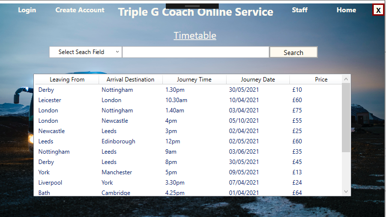
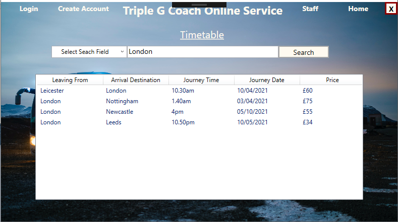
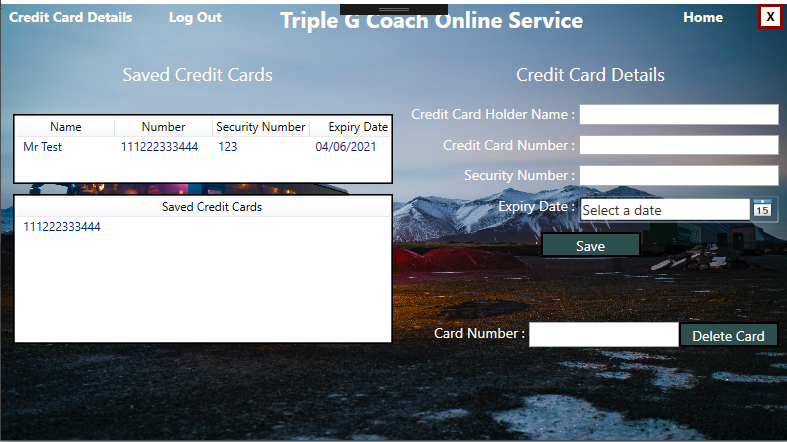
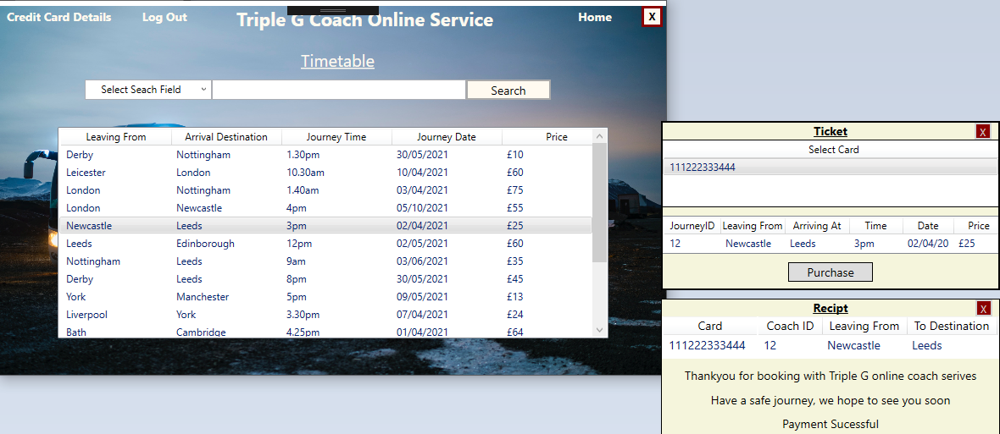
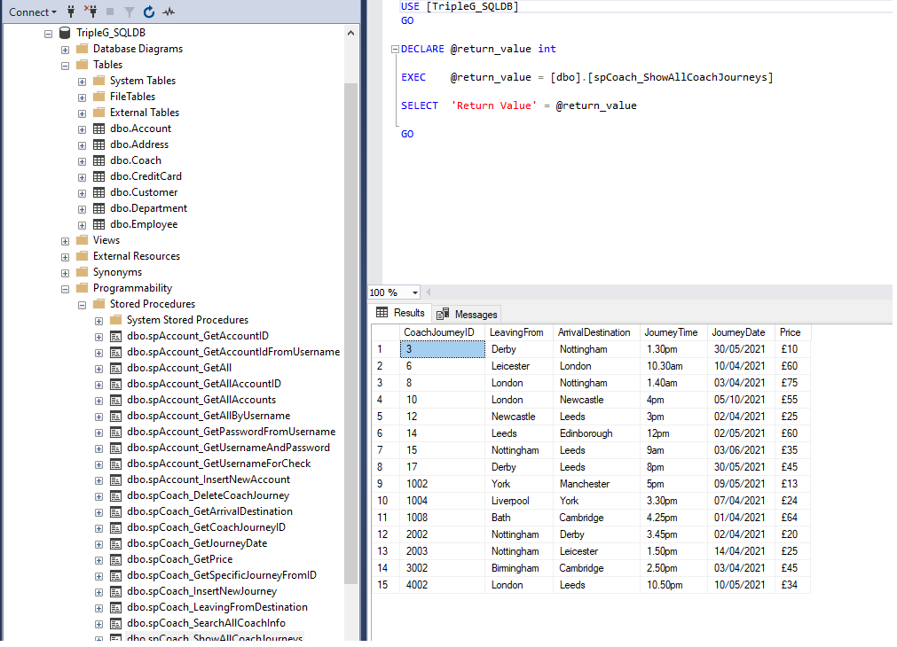

## Triple G Coach Service Application

**Project description:** The application represents an online booking and search feature for an online coach service. 

### 1. Overview

This is an .NET application which was built in Visual Studio 2017 using C# and Xamarin, with SQL for data management (SQL Server management studio was used as the method for creation of Stored Procedures). The primary functions of the application are: account creation, Login, Input and Saving of payment details, Search features, payment method selection.  

### 2. Code Repository Link
https://github.com/PeckW/TripleGCoachService

### 3. Application Examples

